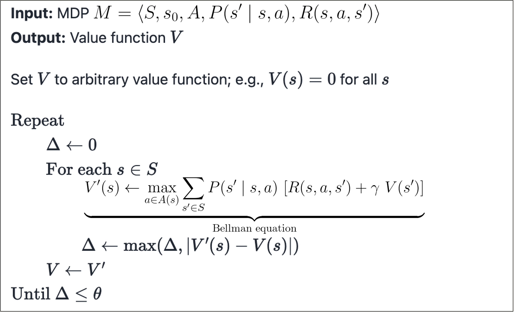
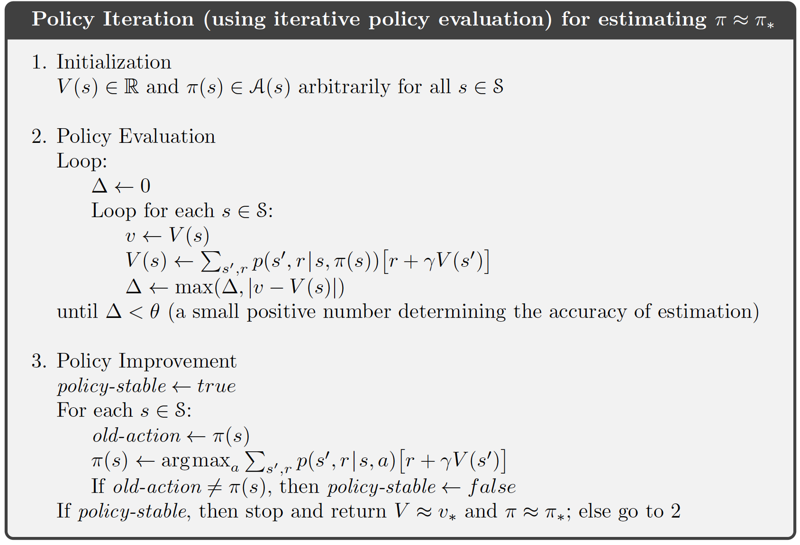
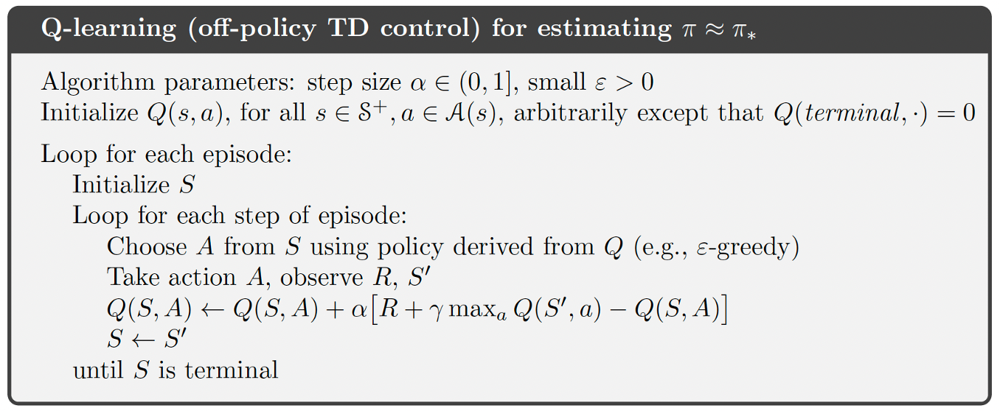

# Gridworld Search Strategies

Classical search and reinforcement-learning policy visualization in Gridworld environments.

## Overview

This project demonstrates search and planning fundamentals through Gridworld tasks. It compares path-search methods such as DFS, BFS, UCS, and A* with dynamic-programming and RL methods such as value iteration, policy iteration, and Q-learning.

## Demo

```html
<video src="assets/gridworld-search-strategies-demo.mp4" controls width="100%"></video>
```

## Visual Results

Gridworld trajectory animation:


Value iteration:



Policy iteration:



Q-learning:



## Highlights

- Visualizes trajectories and learned policies in small grid environments.
- Compares classical search with RL-based planning.
- Useful as a clean fundamentals project for AI/search/RL interviews.
- Best presented as a compact teaching-quality repo, not as scattered course folders.

## Tech Stack

Python, search algorithms, reinforcement learning, Gridworld simulation, notebooks, Matplotlib.

## Repository Structure

```text
assets/       Demo video, GIFs, and policy visualizations
notebooks/    Clean walkthrough notebooks
src/          Gridworld environment and algorithms
tests/        Basic correctness tests for search/planning methods
```

## Suggested Cleanup

Keep one implementation per algorithm, one or two notebooks, and the final visualizations. Remove checkpoint notebooks, duplicate unsafe/safe variants unless explicitly explained, and course-only files.
