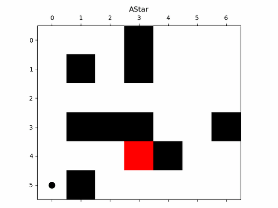
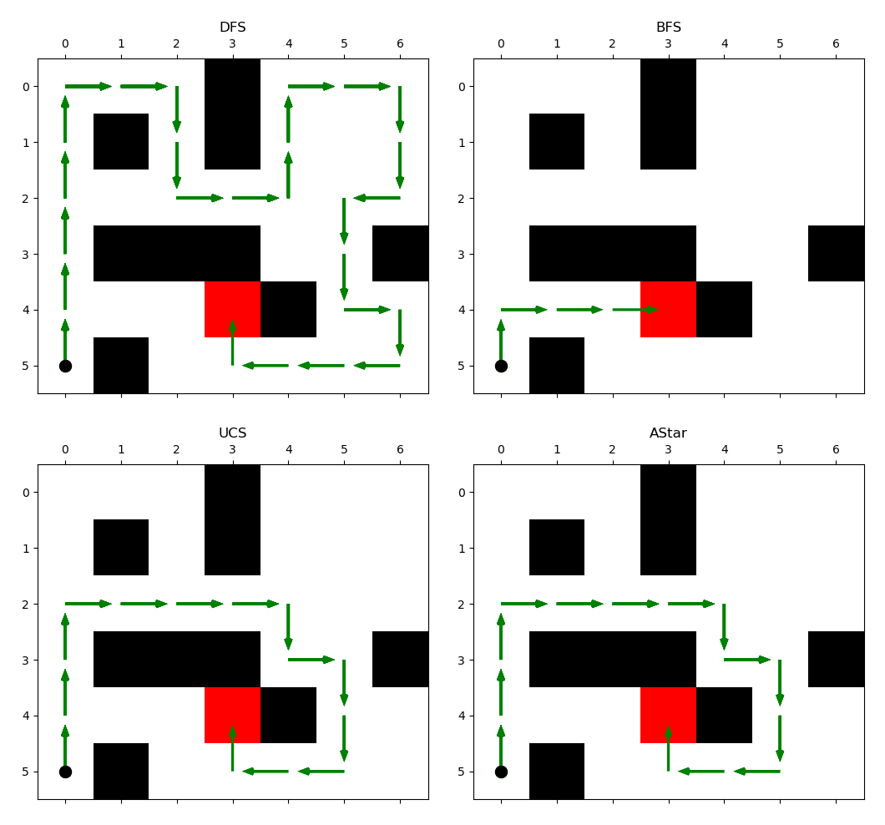
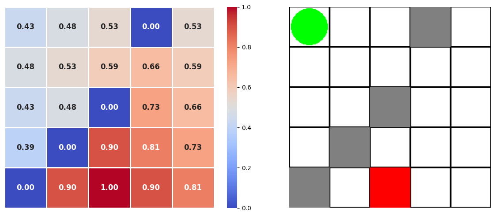
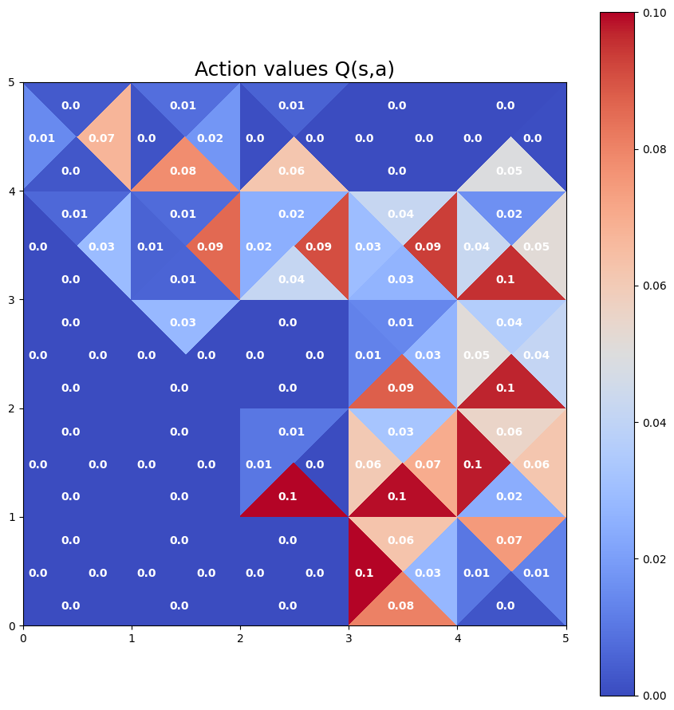

# Gridworld Search & Planning Strategies

**Classical search and reinforcement-learning planning in gridworld environments — implemented and visualized side by side.**

A compact fundamentals project that shows how different families of algorithms solve the same kind of gridworld navigation task: uninformed and informed **search** (DFS, BFS, UCS, A\*), **dynamic programming** (value & policy iteration), and **model-free RL** (Q-learning).

## Demo



*A\* incrementally expanding a path from the start (bottom-left dot) to the goal (red), routing around obstacles.*

## Classical search: DFS vs BFS vs UCS vs A\*



Same environment, four strategies. **DFS** plunges deep and wanders; **BFS** returns a shortest path in steps; **UCS** expands by cumulative path cost; **A\*** uses a heuristic to reach the goal while expanding far fewer cells.

## Planning & reinforcement learning



*Converged state values **V(s)** from value iteration, shown next to the gridworld layout (start = green, goal = red, obstacles = gray).*



*Per-state action values **Q(s,a)** learned by tabular Q-learning — each cell's four triangles show the value of moving up / down / left / right.*

## Algorithms implemented

- **Search:** Depth-First, Breadth-First, Uniform-Cost, and A\* search.
- **Dynamic programming:** value iteration and policy iteration (Bellman backups over the MDP).
- **Model-free RL:** tabular Q-learning with ε-greedy exploration and temporal-difference updates.

## Code

```text
search/             DFS / BFS / UCS / A* over a gridworld  (search_algorithms.ipynb, myAgent.py)
planning_and_rl/    value iteration, policy iteration, Q-learning  (+ gridworld env, utils)
requirements.txt    dependencies
```

## Tech stack

Python · NumPy · Matplotlib · Jupyter · OpenAI Gym
